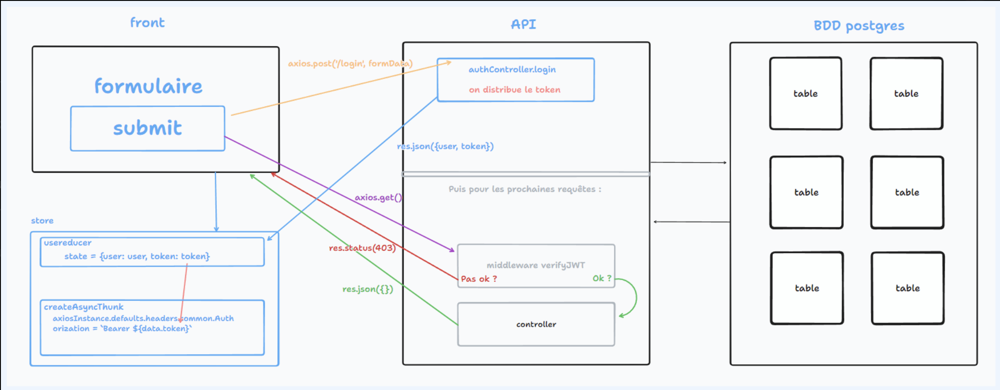
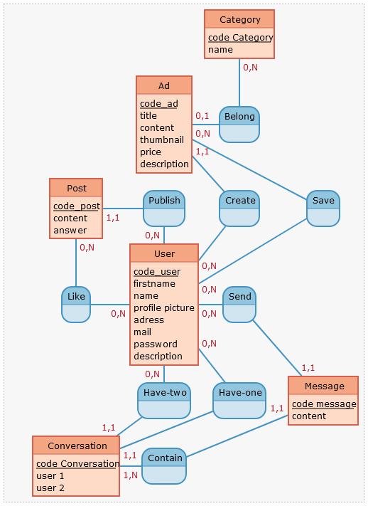
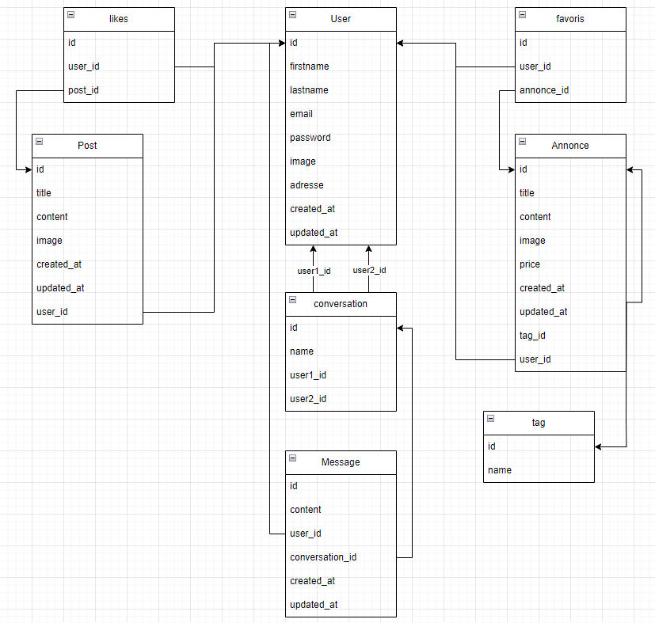

# Cahier des charges

- Sommaire

# Introduction

**Tok-Tok : votre réseau social de proximité**

Tok-toK, le réseau social qui rapproche les voisins et renforce la communauté de proximité. Notre plateforme en ligne offre un espace convivial et interactif où vous pouvez interagir avec vos voisins, partager des informations, échanger des services, et bien plus encore.

# Description générale du projet

- **Écrire / réagir à des posts** 🖊️
    
    Sur Tok-Tok, vous pouvez créer des publications pour partager des informations, des événements locaux, des conseils utiles, ou simplement pour engager une conversation avec vos voisins. Vous pouvez également réagir et commenter les publications des autres membres, favorisant ainsi un esprit d'entraide et de solidarité au sein de votre quartier.
    
- **Petites annonces** 📦📢
    
    Besoin de vendre des objets dont vous n'avez plus besoin ou de rechercher des articles d'occasion ? Notre site vous permet de publier des petites annonces pour acheter, vendre, ou échanger des biens avec les autres membres de la communauté. C'est un excellent moyen de donner une seconde vie à des objets et de réaliser des économies.
    
- **Recherche** 🔍
    
    La fonction de recherche intégrée vous permet de trouver rapidement des informations spécifiques sur Tok-Tok. Que vous recherchiez des recommandations pour un bon restaurant local, des services professionnels, ou des événements à venir, vous pouvez effectuer une 
    recherche par mots-clés et filtrer les résultats en fonction de votre localisation.
    
- **Profil** 🧑‍
    
    Chaque membre dispose d'un profil personnalisé où il peut partager des informations sur lui-même, ses intérêts, et sa localisation. Cela facilite l'établissement de liens et la découverte de personnes partageant les mêmes centres d'intérêt dans votre voisinage. Vous pouvez également afficher votre historique d'activités sur le site, telles que vos publications, vos commentaires, et vos transactions.
    
- **Messages privés** 💌
    
    La messagerie privée intégrée vous permet de communiquer directement avec d'autres membres de Tok-Tok. Vous pouvez envoyer des messages, partager des informations confidentielles, ou discuter de projets spécifiques. Cela facilite les échanges et les interactions privées entre voisins.
    
- **Paiement en ligne** 💳
    
    Pour faciliter les transactions et les échanges de services au sein de la communauté, Tok-Tok propose un système de paiement en ligne sécurisé. Vous pouvez effectuer des paiements directement sur la plateforme, ce qui vous permet d'acheter des biens, de rémunérer des services, ou de faire des dons en toute simplicité.
    
- **Géolocalisation** 🗺️
    
    Grâce à la fonction de géocodage, vous pouvez visualiser facilement la localisation des membres, des groupes et des annonces sur une carte interactive. Cela vous permet de mieux comprendre la proximité géographique de la communauté et facilite les interactions locales.
    
- **Groupes** 🧑‍🤝‍🧑
    
    Les groupes thématiques sont un moyen idéal de connecter avec des voisins partageant les mêmes intérêts ou passions. Vous pouvez rejoindre des groupes existants ou en créer de nouveaux pour discuter de sujets spécifiques, organiser des événements locaux, ou coordonner des initiatives communautaires. Les groupes favorisent la collaboration et renforcent les liens sociaux entre voisin
    

# Public cible

- Voisins : Individu proche d’un rayon donné de l’utilisateur (5km-ville)
- Entre 15 ans et encore en vie 🙃
- Petit village à grande ville.

# Définition des besoins

| Problèmes |  | Solutions |
| --- | --- | --- |
| Isolement des personnes |                        → | Création de lien social  |
| Manque de visibilité des commerces locaux |                        → | Commerces et services de proximité (pro) |
| Raviver des quartiers |                        → | Promotion d’événements locaux |
| Développement de l’économie locale et circulaire |                        → | Échange de services (particuliers) |

# Sites de référence

[https://fr.nextdoor.com/](https://fr.nextdoor.com/)

[https://www.allovoisins.com/](https://www.allovoisins.com/)

[https://www.ensembl.fr/](https://www.ensembl.fr/)

[https://proxiigen.com/](https://proxiigen.com/)

[https://fr.smiile.com/](https://fr.smiile.com/)

[https://goodhood.eu/](https://goodhood.eu/)

# Fonctionnalités

## Minimal Viable Product (MVP) :

- [ ]  Login
- [ ]  Profil
- [ ]  Écrire/Réagir/Répondre au messages (mur)
- [ ]  Petites Annonces (création et favoris)
- [ ]  Recherche (annonces/posts/membres)
- [ ]  Pop Up quand réaction à un msg

## Évolutions potentielles :

- [ ]  Panel de modérateur
- [ ]  Système de paiement
- [ ]  Géolocalisation
- [ ]  Messages Privées
- [ ]  Groupes
- [ ]  Badges de participation
- [ ]  Créer des évènements
- [ ]  Partager un message ou une annonce
- [ ]  Profils professionnels

# La liste des technologiques

## **Front :**

- React/TypeScript
- Redux-toolkit
- Sass
- (Tailwind)

### Librairies de composants :

[https://mui.com/](https://mui.com/)

[https://nextui.org/](https://nextui.org/)

[https://react-iconly.jrgarciadev.com/](https://react-iconly.jrgarciadev.com/)

## **Back :**

- NodeJS
- Express
- Postgres
- Sequelize

## **APIs :**

- [Stripe](https://stripe.com/fr) pour les paiements
- [PositionStack](https://positionstack.com/?fpr=geekflare) pour la géolocalisation
- [Multer](https://www.npmjs.com/package/multer) pour upload des images

# Navigateur compatible

Chrome / Firefox / Safari version desktop et mobile.

# Arborescence de l’application

# User Story

- Ouvrir le tableau
    
    Légende : 
    - Noir : A faire
    - Bleu : Optionnel
    - Violet : On sait pas
    
    - Use Story pour MVP
        
        
        | En tant que… | je veux pouvoir.. | dans le but de… | Feature |  |
        | --- | --- | --- | --- | --- |
        | Visiteur | avoir un aperçu du site | Décider si je m’inscris | Accueil (visiteur) |  |
        |  | m’inscrire | pouvoir m’identifier |  |  |
        |  | m’identifier | voir la communauté et ses agissements |  |  |
        | Utilisateur | me connecter | accéder à mon compte | Login |  |
        |  | me déconnecter | fermer l’accès à mon compte |  |  |
        |  | modifier mes informations personnelles | mettre à jour mon profil (mdp, adresse, email, nom etc) | Profil |  |
        |  | cliquer sur un profil | afficher ses posts, ses informations publiques et ses annonces (et la suivre ?) |  |  |
        |  | voir les posts des personnes dans mon quartier | me tenir au courant | Posts |  |
        |  | écrire et envoyer un post | m’exprimer, informer mes voisins |  |  |
        |  | modifier un post  | corriger une erreur |  |  |
        |  | supprimer un post |  |  |  |
        |  | répondre à un post |  |  |  |
        |  | aimer un post | montrer mon intérêt |  |  |
        |  | ne plus aimer un post |  |  |  |
        |  | cacher un post | qu’il n’apparaisse plus sur le fil d’actualités |  |  |
        |  | voir les annonces autour de moi  | acheter sur ou en dehors de la plateforme | Annonces |  |
        |  | Créer une annonce | proposer un bien ou un service |  |  |
        |  | supprimer une annonce | retirer l’annonce |  |  |
        |  | Cliquer sur une annonce | la consulter |  |  |
        |  | Répondre à une annonce | entrer en contact avec l’annonceur  |  |  |
        |  | enregistrer des annonces | les retrouver plus tard | Favoris annonces |  |
        |  | supprimer une annonce de mes favoris | plus voir l’annonce dans mes favoris |  |  |
        |  | rechercher des posts | voir des posts  | Rechercher |  |
        |  | rechercher des annonces |  |  |  |
        |  | cliquer sur ma messagerie | voir mon historique de conversation | MP |  |
        |  | envoyer un message privé | communiquer avec un membre |  |  |
    - Use Story optionnel
        
        
        | Utilisateur | partager un post | d’informer les non membres d’autres plateformes du post |  |
        | --- | --- | --- | --- |
        |  | historique des notifications | voir quand j’ai reçu une notification | Notifications |
        |  | Partager une annonce | promouvoir une annonce |  |
        |  | ajouter un membre à ma liste d’amis | pouvoir discuter avec lui par message privée |  |
        |  | supprimer un membre de ma liste d’amis | ne plus pouvoir discuter avec lui |  |
        |  | Accéder et lire chartes utilisation | être au courant des règles | Règles |
        |  | Négocier le prix d’une annonce | baisser le prix | Négocier annonces |
        |  | Choisir rayon de recherche dans les annonces | afin de trouver mon bonheur qu’importe la distance | Localisation |
        |  | modifier mon rayon de visibilité des posts | voir plus de posts sur mon fil d’actualité |  |
        |  | payer un autre membre pour un service ou un objet | m’acquitter de la somme prévu par l’annonce pour un service/objet | Paiement d’une annonce |
        |  | avoir accès à mes précédents achats ou services rendu depuis le site | voir l’historique de mes achats / services rendus sur la plateforme | Historique achat |
        |  | supprimer un message  |  |  |
        |  | supprimer mon compte | quitter le Réseau social/données |  |
        |  | créer un groupe | rassembler les gens autour d’une même passion | Groupe |
        |  | écrire un message dans un groupe | communiquer avec une sous-communauté |  |
        |  | répondre à un message d’un groupe | communiquer avec une sous-communauté |  |
        |  | inviter des personnes à un groupe | faire grossier le groupe |  |
        |  | partager un message d’un groupe | promouvoir le groupe |  |
        |  | créer un évènement  | afin de promouvoir une activité | Evènement |
        |  | modifier un évènement | afin de modifier les informations |  |
        |  | supprimer un évènement | afin de ne plus promouvoir l’évènement |  |
        |  | inviter des personnes à un évènement | afin de faire grandir l’évènement |  |
        |  | Signaler | Prévenir modération d’acte répréhensible (post, annonces, groupes, évènements…) |  |
        | Modérateur | accéder à un panel d’admin | voir les signalements | Panel modo |
        |  | Recevoir alerte usagers |  |  |
        |  | Supprimer Post et Annonce (groupes et event) |  |  |
        |  | Modifier Post et Annonce (groupes et event) |  |  |

# Wireframe

## Propositions :

- PapaTom
    
    
    
- John
    
    
    
- Chloé
    
    
    

## Pages définitives :

### Homepage (visiteur)

### Accueil (membre)

### Mon profil

### Annonces

### Annonce

### Favoris

### Messagerie

### Créer une annonce

# BDD

### MCD

[https://www.notion.so](https://www.notion.so)

### MLD

## Dico de données

Table user

| Champ | Type | Spécificités | Description |
| --- | --- | --- | --- |
| id | INT | PRIMARY KEY, UNSIGNED, NOT NULL, AUTO_INCREMENT | I’identifiant de la personne |
| firstname | VARCHAR(64) | NOT NULL | Le prénom de la personne |
| lastname | VARCHAR(64) | NOT NULL | Le nom de la personne |
| adress | TEXT | NOT NULL | L’adresse de personne |
| email | VARCHAR(64) | NOT NULL | L’email de la personne |
| password | VARCHAR(64) | NOT NULL | Le mot de passe de la personne |
| profile_picture | TEXT |  | La photo de profil de la personne |
| created_at | TIMESTAMP | NOT NULL, DEFAULT CURRENT_TIMESTAMP | La date de création du profil |
| updated_at | TIMESTAMP | NOT NULL, DEFAULT CURRENT_TIMESTAMP | La date de dernière modification du profil |
| description | VARCHAR(255) |  | La description de la personne sur son profil |

Table annonce

| Champ | Type | Spécificités | Description |
| --- | --- | --- | --- |
| id | INT | PRIMARY KEY, UNSIGNED, NOT NULL, AUTO_INCREMENT | I’identifiant de l’annonce |
| title | VARCHAR(64) | NOT NULL | Titre de l’Annonce |
| content | TEXT | NOT NULL | Contenu de l’annonce |
| image | TEXT | NOT NULL | Photo de l’objet de l’annonce |
| price | SMALLINT | NOT NULL | Prix de l’objet |
| created_at | TIMESTAMP | NOT NULL, DEFAULT CURRENT_TIMESTAMP | Date de la création de l’annonce |
| updated_at | TIMESTAMP | NOT NULL, DEFAULT CURRENT_TIMESTAMP | Date de la dernière modification |
| user_id | INT | PRIMARY KEY, UNSIGNED, NOT NULL, AUTO_INCREMENT | L’identifiant de la personne qui à crée l’annonce |
| tag_id | INT | PRIMARY KEY, UNSIGNED, NOT NULL, AUTO_INCREMENT | L’identifiant de la catégorie |

Table post

| Champ | Type | Spécificités | Description |
| --- | --- | --- | --- |
| id | INT | PRIMARY KEY, UNSIGNED, NOT NULL, AUTO_INCREMENT | L’identifiant du message |
| content | TEXT | NOT NULL | Le texte du message |
| user_id | ENTITY | PRIMARY KEY, NOT NULL | Le nom de la personne qui a envoyé le message |
| created_at | TIMESTAMP | NOT NULL, DEFAULT CURRENT_TIMESTAMP | La date de création/envoi du post |
| updated_at | TIMESTAMP | NOT NULL, DEFAULT CURRENT_TIMESTAMP | La date de modification du post |
| image | TEXT |  | L’image du post |

Table message 

| Champ | Type | Spécificités | Description |
| --- | --- | --- | --- |
| id | INT | PRIMARY KEY, UNSIGNED, NOT NULL, AUTO_INCREMENT | L’identifiant du message |
| content | TEXT | NOT NULL | Le texte du message |
| user_id | ENTITY | PRIMARY KEY, NOT NULL | Le nom de la personne qui a envoyé le message |
| conversation_id | ENTITY | PRIMARY KEY, NOT NULL | L’identifiant de la conversation |
| created_at | TIMESTAMP | NOT NULL, DEFAULT CURRENT_TIMESTAMP | La date de création/envoi du message |

Table conversation

| Champ | Type | Spécificités | Description |
| --- | --- | --- | --- |
| id | INT | PRIMARY KEY, UNSIGNED, NOT NULL, AUTO_INCREMENT | I’identifiant de la conversation |
| name | CHAR | ????????????????? | Nom de la Conversation |
| user1_id | ENTITY | PRIMARY KEY, NOT NULL | Le nom du premier user |
| user2_id | ENTITY | PRIMARY KEY, NOT NULL | Le nom du second user |

Table tag

| Champ | Type | Spécificités | Description |
| --- | --- | --- | --- |
| id | INT | PRIMARY KEY, UNSIGNED, NOT NULL, AUTO_INCREMENT | L’identifiant de la catégorie |
| name | VARCHAR(64) | NOT NULL | Nom de la catégorie |

Table favoris

| Champ | Type | Spécificités | Description |
| --- | --- | --- | --- |
| id | INT | PRIMARY KEY, UNSIGNED, NOT NULL, AUTO_INCREMENT | L’identifiant de la liaison annonce-user |
| annonce_id | ENTITY | PRIMARY KEY, NOT NULL | L’identifiant de l’annonce |
| user_id | ENTITY | PRIMARY KEY, NOT NULL | L’identifiant de l’utilisateur  |

Table likes

| Champ | Type | Spécificités | Description |
| --- | --- | --- | --- |
| id | INT | PRIMARY KEY, UNSIGNED, NOT NULL, AUTO_INCREMENT | L’identifiant de la liaison post-user |
| post_id | ENTITY | PRIMARY KEY, NOT NULL | L’identifiant du post  |
| user_id | ENTITY | PRIMARY KEY, NOT NULL | L’identifiant de l’utilisateur  |

# Liste des routes

- /
    
    /home
    
     /profil/:id
    
    /annonces
    
    /annonces/:id
    
    /favoris
    
    /messagerie